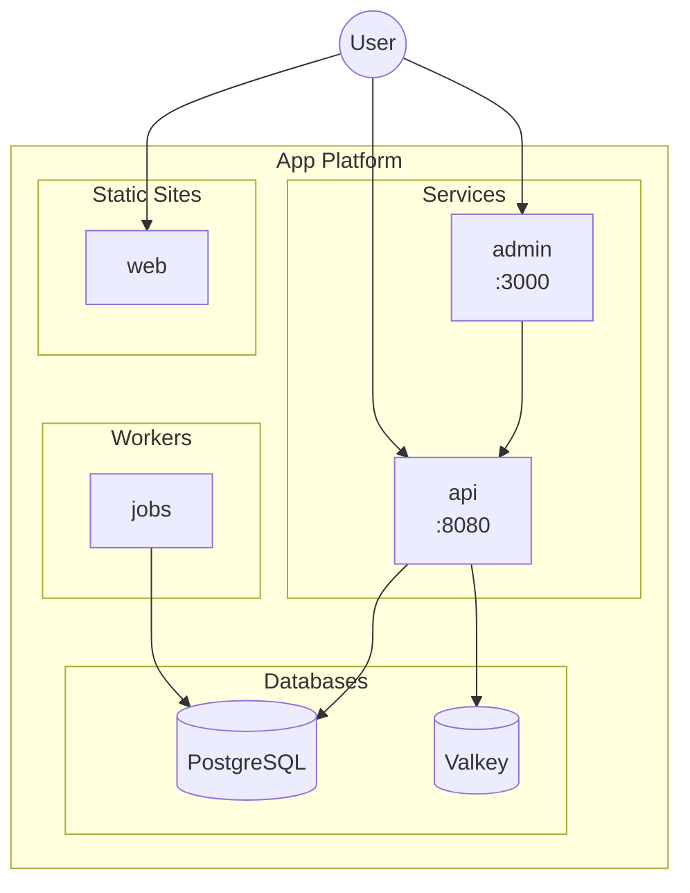

# Architecture Patterns Reference

Complete YAML examples for common App Platform architectures.

---

## Pattern 1: Single Service + Database

The simplest production-ready setup.

```yaml
name: my-app
region: nyc

services:
  - name: web
    git:
      repo_clone_url: https://github.com/owner/repo.git
      branch: main
    http_port: 8080
    instance_size_slug: apps-s-1vcpu-1gb
    instance_count: 1
    health_check:
      http_path: /health
    envs:
      - key: DATABASE_URL
        scope: RUN_TIME
        value: ${db.DATABASE_URL}

databases:
  - name: db
    engine: PG
    production: false
```

**Use when:** Simple CRUD apps, MVPs, personal projects.

---

## Pattern 2: API + Static Frontend

Separate backend API from frontend SPA.

```yaml
name: fullstack-app
region: nyc

services:
  - name: api
    git:
      repo_clone_url: https://github.com/owner/repo.git
      branch: main
    source_dir: /api
    http_port: 8080
    instance_size_slug: apps-s-1vcpu-1gb
    health_check:
      http_path: /health
    envs:
      - key: DATABASE_URL
        scope: RUN_TIME
        value: ${db.DATABASE_URL}

static_sites:
  - name: frontend
    git:
      repo_clone_url: https://github.com/owner/repo.git
      branch: main
    source_dir: /frontend
    build_command: npm run build
    output_dir: dist
    envs:
      - key: VITE_API_URL
        scope: BUILD_TIME
        value: ${api.PUBLIC_URL}

databases:
  - name: db
    engine: PG
    production: false

ingress:
  rules:
    - match:
        path:
          prefix: /api
      component:
        name: api
    - match:
        path:
          prefix: /
      component:
        name: frontend
```

**Use when:** React/Vue/Svelte + REST API, JAMstack apps.

---

## Pattern 3: Service + Worker + Database

For apps with background processing.

```yaml
name: async-app
region: nyc

services:
  - name: api
    git:
      repo_clone_url: https://github.com/owner/repo.git
      branch: main
    http_port: 8080
    instance_size_slug: apps-s-1vcpu-1gb
    health_check:
      http_path: /health
    envs:
      - key: DATABASE_URL
        scope: RUN_TIME
        value: ${db.DATABASE_URL}
      - key: VALKEY_URL
        scope: RUN_TIME
        value: ${cache.DATABASE_URL}

workers:
  - name: processor
    git:
      repo_clone_url: https://github.com/owner/repo.git
      branch: main
    run_command: python worker.py
    instance_size_slug: apps-s-1vcpu-0.5gb
    envs:
      - key: DATABASE_URL
        scope: RUN_TIME
        value: ${db.DATABASE_URL}
      - key: VALKEY_URL
        scope: RUN_TIME
        value: ${cache.DATABASE_URL}

databases:
  - name: db
    engine: PG
    production: false
  - name: cache
    engine: VALKEY
    production: false
```

**Use when:** Email queues, image processing, async tasks.

---

## Pattern 4: Monorepo Multi-Service

Multiple services from one repository.

```yaml
name: monorepo-app
region: nyc

services:
  - name: api
    git:
      repo_clone_url: https://github.com/owner/repo.git
      branch: main
    source_dir: /packages/api
    http_port: 8080
    instance_size_slug: apps-s-1vcpu-1gb
    health_check:
      http_path: /health

  - name: admin
    git:
      repo_clone_url: https://github.com/owner/repo.git
      branch: main
    source_dir: /packages/admin
    http_port: 3000
    instance_size_slug: apps-s-1vcpu-0.5gb
    health_check:
      http_path: /health

static_sites:
  - name: web
    git:
      repo_clone_url: https://github.com/owner/repo.git
      branch: main
    source_dir: /packages/web
    build_command: npm run build
    output_dir: dist

ingress:
  rules:
    - match:
        path:
          prefix: /api
      component:
        name: api
    - match:
        path:
          prefix: /admin
      component:
        name: admin
    - match:
        path:
          prefix: /
      component:
        name: web
```

**Key:** Use `source_dir` to point to each package's directory.

**Use when:** Turborepo, Nx, pnpm workspaces, Lerna projects.

---

## Pattern 5: SaaS Multi-Component

Complex SaaS with multiple user-facing services.

```yaml
name: saas-platform
region: nyc

services:
  - name: api
    git:
      repo_clone_url: https://github.com/owner/repo.git
      branch: main
    source_dir: /services/api
    http_port: 8080
    instance_size_slug: apps-s-1vcpu-2gb
    instance_count: 2
    autoscaling:
      min_instance_count: 2
      max_instance_count: 10
      metrics:
        cpu:
          percent: 70
    health_check:
      http_path: /health
    envs:
      - key: DATABASE_URL
        scope: RUN_TIME
        value: ${db.DATABASE_URL}

workers:
  - name: jobs
    git:
      repo_clone_url: https://github.com/owner/repo.git
      branch: main
    source_dir: /services/jobs
    run_command: node worker.js
    instance_size_slug: apps-s-1vcpu-1gb
    envs:
      - key: DATABASE_URL
        scope: RUN_TIME
        value: ${db.DATABASE_URL}

jobs:
  - name: migrate
    kind: PRE_DEPLOY
    git:
      repo_clone_url: https://github.com/owner/repo.git
      branch: main
    source_dir: /services/api
    run_command: npm run migrate

  - name: daily-reports
    kind: SCHEDULED
    schedule:
      cron: "0 6 * * *"
    git:
      repo_clone_url: https://github.com/owner/repo.git
      branch: main
    source_dir: /services/reports
    run_command: python generate.py

static_sites:
  - name: dashboard
    git:
      repo_clone_url: https://github.com/owner/repo.git
      branch: main
    source_dir: /apps/dashboard
    build_command: npm run build
    output_dir: dist

  - name: marketing
    git:
      repo_clone_url: https://github.com/owner/repo.git
      branch: main
    source_dir: /apps/marketing
    build_command: npm run build
    output_dir: out

databases:
  - name: db
    engine: PG
    production: true
    cluster_name: saas-prod-db

domains:
  - domain: api.example.com
    type: PRIMARY
  - domain: app.example.com
    type: ALIAS
  - domain: www.example.com
    type: ALIAS

ingress:
  rules:
    - match:
        path:
          prefix: /api
      component:
        name: api
    - match:
        path:
          prefix: /
      component:
        name: dashboard

alerts:
  - rule: DEPLOYMENT_FAILED
  - rule: DOMAIN_FAILED
```

**Use when:** Production SaaS, multi-tenant platforms, enterprise apps.

---

## Pattern Selection Guide

```
What are you building?
├── Simple app (1 service)?
│   └── Pattern 1: Single Service + Database
├── Frontend + API?
│   └── Pattern 2: API + Static Frontend
├── Need background processing?
│   └── Pattern 3: Service + Worker + Database
├── Monorepo with multiple packages?
│   └── Pattern 4: Monorepo Multi-Service
└── Complex SaaS with scaling?
    └── Pattern 5: SaaS Multi-Component
```

---

## Multi-Environment Variations

### Development Environment

```yaml
name: my-app-dev
region: nyc

services:
  - name: api
    instance_size_slug: apps-s-1vcpu-0.5gb  # Smaller
    instance_count: 1

databases:
  - name: db
    engine: PG
    production: false  # Dev database
```

### Staging Environment

```yaml
name: my-app-staging
region: nyc

services:
  - name: api
    instance_size_slug: apps-s-1vcpu-1gb
    instance_count: 1

databases:
  - name: db
    engine: PG
    production: true
    cluster_name: staging-db

domains:
  - domain: staging.example.com
    type: PRIMARY
```

### Production Environment

```yaml
name: my-app-prod
region: nyc

services:
  - name: api
    instance_size_slug: apps-d-1vcpu-2gb  # Dedicated
    instance_count: 2
    autoscaling:
      min_instance_count: 2
      max_instance_count: 10
      metrics:
        cpu:
          percent: 70

databases:
  - name: db
    engine: PG
    production: true
    cluster_name: prod-db

domains:
  - domain: example.com
    type: PRIMARY
  - domain: www.example.com
    type: ALIAS
```

### Environment Comparison

| Aspect | Dev | Staging | Prod |
|--------|-----|---------|------|
| Instance size | `apps-s-1vcpu-0.5gb` | `apps-s-1vcpu-1gb` | `apps-d-1vcpu-2gb` |
| Instance count | 1 | 1 | 2+ |
| Database | Dev DB | Managed (small) | Managed (sized) |
| Domain | `*.ondigitalocean.app` | `staging.example.com` | `example.com` |
| Autoscaling | No | No | Yes |

---

## Architecture Diagrams

For complex apps (3+ components), generate a Mermaid diagram:


